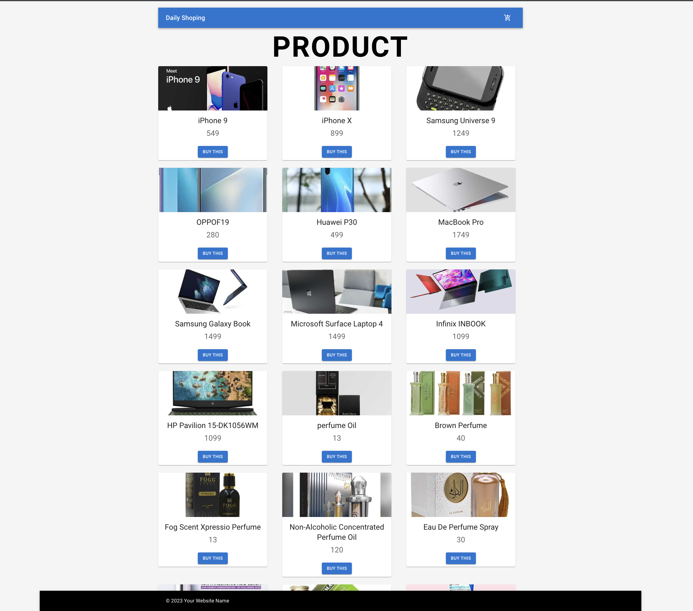
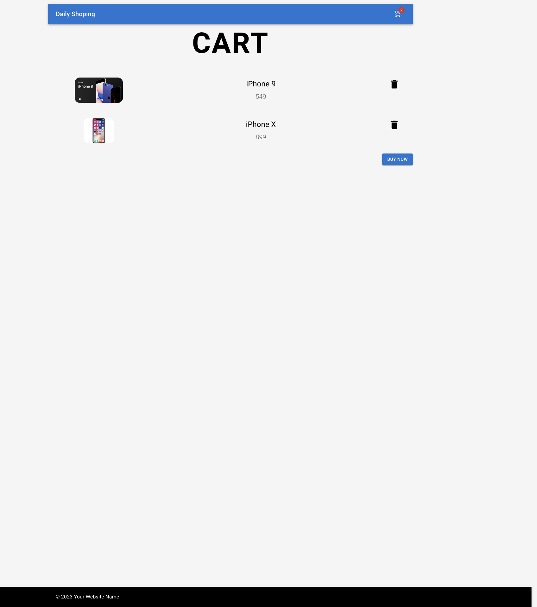
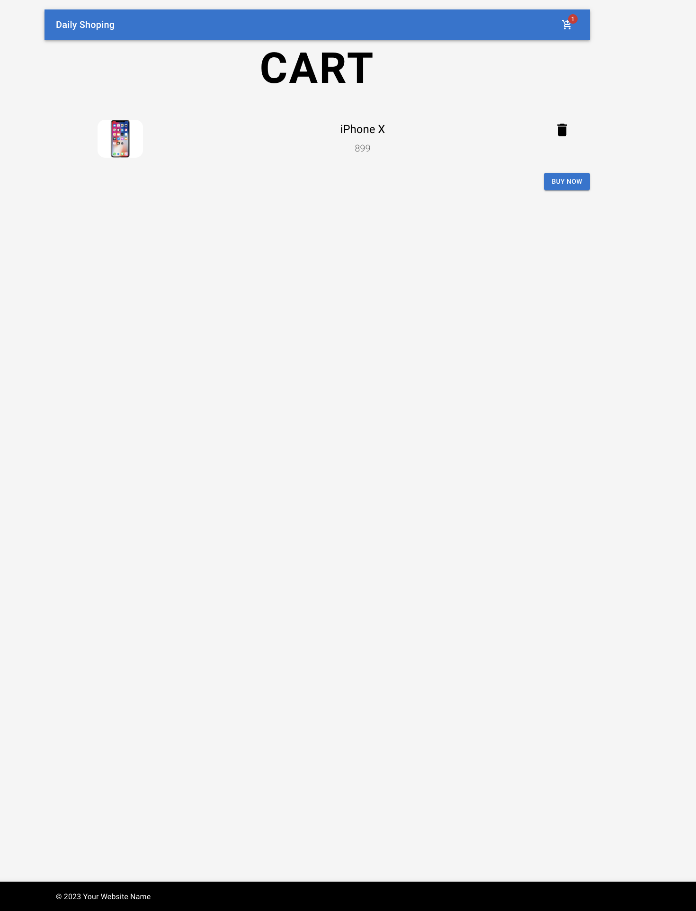
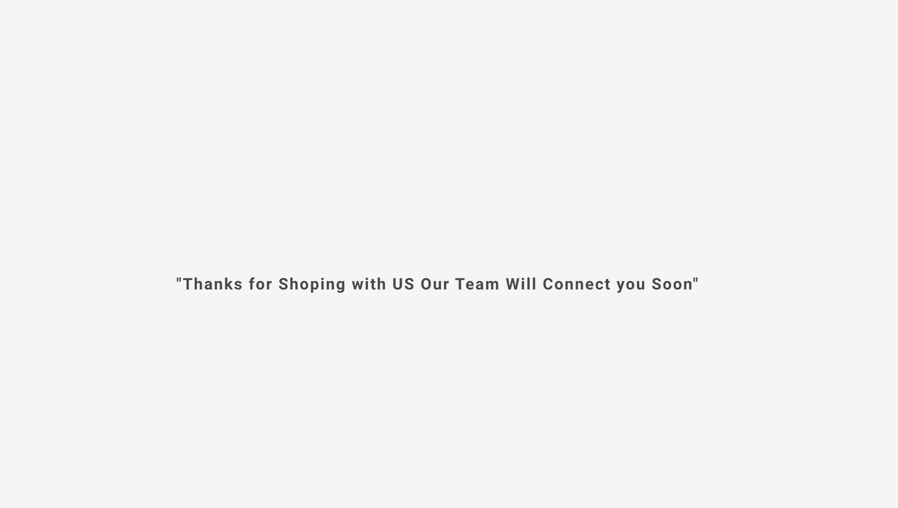

# My React Project with Material-UI, Redux Toolkit, and Docker 🚀

## Prerequisites

Before diving into the project, make sure you have the following essentials installed on your machine:

- [Docker](https://www.docker.com/products/docker-desktop) 🐳

## Project Overview 📝

Welcome to our e-commerce website built with React, Material-UI, Redux Toolkit, and Docker. This project showcases the power of modern web technologies in creating a seamless shopping experience.

## Features and Technologies Used 🛠️

- **React**: A JavaScript library for building user interfaces.
- **Material-UI**: A popular React UI framework that follows Google's Material Design guidelines.
- **Redux Toolkit**: A state management library for React applications.
- **React Router DOM**: A library for client-side routing in React applications.
- **Docker**: Containerization technology for easy deployment.

## Getting Started 🚀

Follow these steps to set up and run the project on your local machine:

1. **Clone the Repository**:

   ```bash
   git clone https://github.com/your-username/your-repo.git
   cd your-repo

Install Dependencies:

After cloning the repository, navigate to the project directory and install the project's dependencies using npm:
npm install

Docker Setup:

Build and Run Docker Containers:

Use Docker Compose to build and run the Docker containers:

bash
Copy code
docker-compose up -d
⏳ Wait for a few minutes:

The first time you run the Docker containers, it might take a few minutes for everything to set up, especially if dependencies need to be downloaded.

Access the React App:

Once the containers are up and running, you can access the React app in your browser by navigating to http://localhost:3000.

-**Screen**
-
-
-
-

Explore and Enjoy! 🎉

Explore our e-commerce website, add products to your cart, and experience a smooth shopping journey. This project demonstrates how to create a visually appealing and interactive web application using modern web technologies. Feel free to customize and enhance it further to meet your needs. Happy coding! 👨‍💻🛒